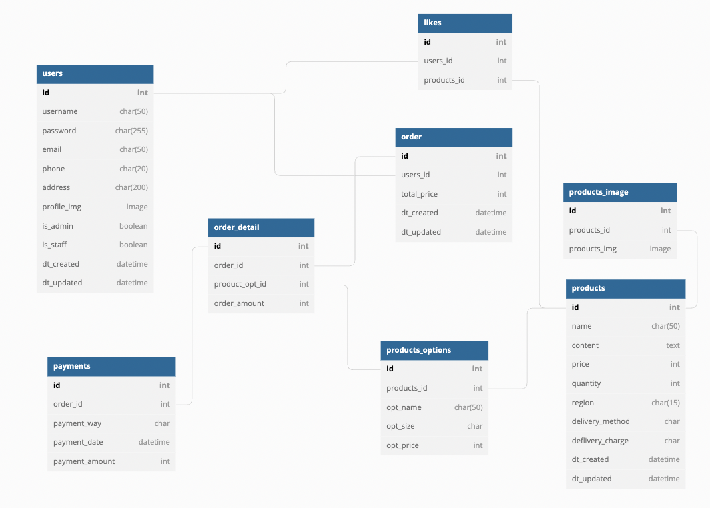

# 목차

1. e-commerce
2. 구현사항
3. 기술 스택
4. API Endpoints
5. ERD

 

---

# 1. e-commerce
- 유저 API, 제품 API, 주문 API, 결재 API 를 활용한 커머스 사이트 구현.
- 개발 기간: 2022.09.09 ~ 2022.09.14

 

---

# 2. 구현 사항

## 1) 유저 API

- 회원가입
  - 비밀번호 해싱
- 로그인
    - SimpleJWT 사용
    - 로그인 시 access token 발급

 

## 2) 제품 CRUD

- 제품 Create
    - 관리자가 아닐 경우 생성 불가
    - 제품 다중 이미지 저장
- 제품 Read
    - 모든 유저 조회 가능
    - 제품 리스트, 상세 조회 기능 구현
- 제품 Update
    - admin만 수정 가능
- 제품 Delete
    - admin만 삭제 가능

 

## 3) 주문 API

- 구현 예정

 

## 4) 상세 주문 API

- 구현 예정
 

## 4) 결제 CRUD

- 구현 예정

 

---

# 3. 기술 스택
Language | Framwork | Database | HTTP | Tools
| :----------------------------------------------------------------------------------------------------: | :----------------------------------------------------------------------------------------------------: | :--------------------------------------------------------------------------------------------------: | :----------------------------------------------------------------------------------------------------------: | :------------------------------------------------------------------------------------------------------: | 
|  |  |  |  |  

 

---

# 4. API Endpoints
| endpoint | HTTP Method | 기능   | require parameter                                                                                                   | response data |
|----------|-------------|------|---------------------------------------------------------------------------------------------------------------------|---------------|
| 작성 예정    |||  |  |

 

---

# 5. ERD

 

---

# 6. 참조 문서
- ..

